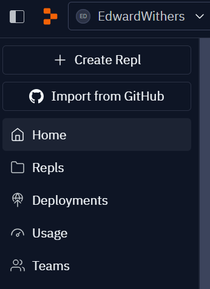

# GitHub Starter

### Quickstart
```sh
$ git clone git@github.com:ark-pioneer/github-starter.git && cd github-starter
```

### Instructions
1. Person A - fork the repository to your github account. Then add your partner as a [github collaborator](https://docs.github.com/en/issues/planning-and-tracking-with-projects/managing-your-project/managing-access-to-your-projects).
2. Person A - in repl.it import a github repository 
3. Person A - make a change to a file. Then in the Workspace Features click on 'Git'. Click on Stage All. Then enter a commit message. Then click stage and commit all changes. Then Push your changes.
3. Person A - Verify you see your changes in the github repo.

1. Person B - in repl.it import a github repository - the one you are both working on.
2. Repeat the process for making a change. Verify you see the changes.

1. Person A - in Git 'Pull' the new changes.


Now each practice making changes to the file and going through the process of pulling any new changes, then staging, commiting, pushing your changes.